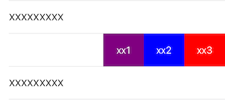

XXSwipeTableViewCell
==================

UITableViewCell 自定义侧滑菜单

    

# 系统要求
* iOS 9.0 及以上
* 需要 ARC

# 集成

* `git clone https://github.com/solehe/XXSwipeTableViewCell`
* 拷贝 `XXSwipeTableViewCell` 中的源代码到你的工程中

# 使用方法
* 自定义Cell并继承XXSwipeTableViewCell，然后设置itemViews。
* 如果某个菜单需要二次确认，需要设置它的type为XXSwipeItemTypeDestructive。
* 如果不满足需求，那就自己改源码吧！！！

# 联系我
* https://github.com/solehe
* soleworld@163.com

# 许可证

XXSwipeTableViewCell 使用 [MIT license][MIT] 许可证，详情见 LICENSE 文件。
